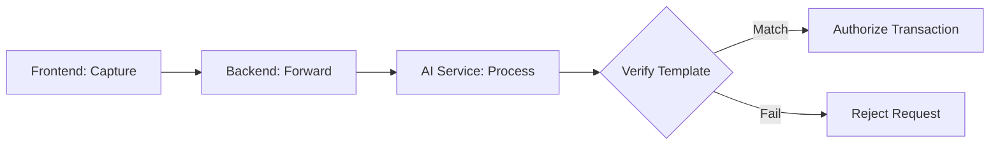

# 🌴 PalmPay Wallet: Biometric Financial Ecosystem (FYP Edition)

## 📌 Project Abstract
PalmPay is a cutting-edge biometric digital banking system developed as a Final Year Project (FYP). It addresses the critical need for secure, real-time, and user-friendly financial management. The system integrates a **MERN stack** architecture with a custom **Python-based AI Biometric Service**, providing a multi-factor authentication (MFA) layer that uses palm-print recognition to authorize high-value transactions.

---

## 🏗️ Technical Architecture & Design Rationale

### 1. Three-Tier Micro-Service Design
The system is divided into three distinct operational layers to ensure scalability and separation of concerns:
- **Presentation Layer (React/Vite)**: A glassmorphic, high-performance UI that uses Zustand for global state and Socket.IO for live data streaming.
- **Application Layer (Node.js/Express)**: Acts as the primary API Gateway and Orchestrator. It manages authentication (via Clerk), data persistence (via MongoDB), and real-time event broadcasting.
- **Biometric Layer (Python/FastAPI)**: A specialized AI service that processes image buffers using computer vision to identify and verify unique palm signatures.

### 2. Real-time Synchronization (Socket.IO)
To maintain academic rigor in financial consistency, PalmPay implements a **Server-Side Authoritative Event Loop**:
1. **Mutation**: User initiates a transaction.
2. **Verification**: Backend verifies the palm signature via the AI layer and auth via Clerk.
3. **Persistence**: Database commit using **ACID Transactions** (Mongoose sessions).
4. **Broadcasting**: Only *after* a successful commit, the backend emits to specific User Rooms (`user:clerkId`).
5. **Reconciliation**: Frontend listens for events and performs "Differential Updates" to the Zustand store, ensuring no page refresh is required.

---

## 🔐 Security & Identity Implementation

### Palm-Print Recognition Pipeline

- **Privacy**: The system forwards image buffers directly to the AI service; no raw biometric images are stored in the main user database.
- **Identity**: Linked via **Clerk ID**, providing a decoupled identity provider (IdP) that significantly reduces the backend's attack surface.

---

## 📊 Database Schema & Data Models

### Wallet Model
- `userId`: **Foreign Key** (Clerk ID String).
- `balance`: **Decimal-safe Number**.
- `limits`: Nested object for academic daily/monthly cap logic.

### Transaction Model (Double-Journaling)
- `sender`/`recipient`: Display names.
- `userId`: Targeted user for this specific ledger entry.
- `reference`: **Unique Idempotency Key**.
- `type`: `debit`, `credit`, `deposit`, `transfer`.

---

## 🛠️ Implementation Specs

### Backend Utilities
- `backend/realtime/io.js`: Singleton pattern for the IO instance.
- `backend/middleware/authMiddleware.js`: Higher-order function for Clerk JWT verification.
- `backend/realtime/socketAuth.js`: Handshake-level authentication for realtime security.

### Frontend Store Logic
- **`walletStore`**: Centralized domain data handler.
- **`realtimeStore`**: Logic for connection persistence and **Event Deduplication** (prevents processing the same event twice across tabs).

---

## 🚀 Future Roadmap for FYP Expansion

### 1. Blockchain Ledger Integration
Migrating the transaction history to a private Hyperledger or Ethereum-based ledger for immutable auditing.

### 2. Advanced AI Features
Implementing **Liveness Detection** in the Palm Auth service to prevent spoofing via high-resolution photos.

### 3. Financial Analytics
Using OpenAI/LLMs to provide users with spending insight summaries directly on the Dashboard.

---

## 👨‍💻 FYP Team Setup Instructions

### Environment Variables Matrix
| Key | Context | Purpose |
| :--- | :--- | :--- |
| `CLERK_SECRET_KEY` | Backend | Server-side API access to Clerk |
| `MONGODB_URI` | Backend | Database connection string |
| `PALM_AUTH_URL` | Backend | Pointing to the Python AI service |
| `VITE_CLERK_PUBLISHABLE_KEY` | Frontend | Identity provider client key |

### Execution Guide
1. **Database**: Create a MongoDB Atlas cluster and whitelist your IP.
2. **Identity**: Set up a Clerk application and configure the JWT template.
3. **AI Service**: Ensure Python `venv` is active and requirements are installed.
4. **Boot**: Run `pnpm dev` from the root to launch all three services concurrently.

---

## 📜 Academic Acknowledgments
This project demonstrates the successful integration of real-time distributed systems, machine learning for biometrics, and secure financial software engineering. It is intended for educational and prototyping purposes within the scope of the Final Year Project.
